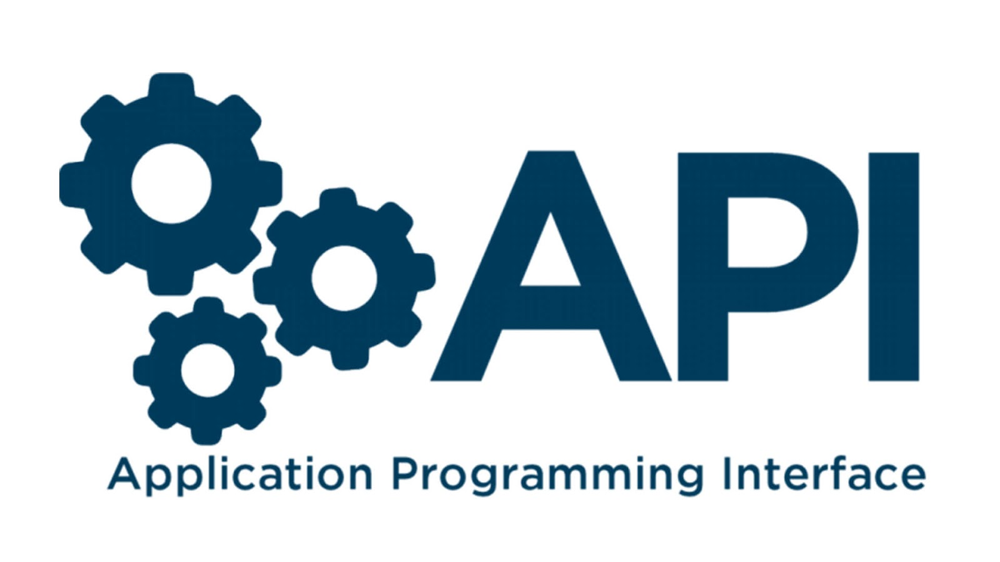

# Api
 The Fetch API provides a JavaScript interface for accessing and manipulating parts of the protocol, such as requests and responses. It also provides a global fetch() method that provides an easy, logical way to fetch resources asynchronously across the network.

 

 # Rest Api

 REST APIs are an industry-standard way for web services to send and receive data. They use HTTP request methods to facilitate the request-response cycle and typically transfer data using JSON, and more rarely - HTML, XML and other formats.

 

 # Axios

 Axios is a promise-based HTTP Client for node.js and the browser. It is isomorphic (= it can run in the browser and nodejs with the same codebase). On the server-side it uses the native node.js http module, while on the client (browser) it uses XMLHttpRequests.

 * 1.Get

 * const postCreate = async () => {
* try {
* const { data } = await axios.get(`url`)
* } catch (error) {
* }
* }

* 2.Post

> const postCreate = async (editUser) => {  
> try {  
> const { data } = await axios.post(`url`, editUser)  
> } catch (error) {  
> }  
> }  

* 3.Delete

* const postCreate = async (id) => {
* try {
* const { data } = await axios.delete(`url`/${id})
* } catch (error) {
* }
* }

* 4.Put

* const postCreate = async (editUser) => {
* try {
* const { data } = await axios.put(`url`/${id},editUser)
* } catch (error) {
* }
* }
"# Axios" 
